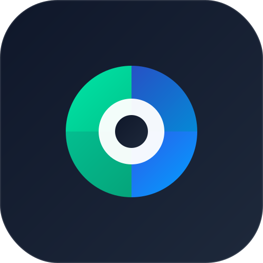

<div align="center">
  
  <h1>🚀 DataFerry : Feishu & Lark Master Migrator</h1>
  <h3>飞书 / Lark 双视窗全景可视化文档迁移与本地归档引擎</h3>
  <p>The most visually stunning and structurally powerful open-source tool for precise, 1:1 cloud document migration and offline ZIP archiving between Feishu and Lark.</p>

  <p>
    <a href="#-core-architecture--核心黑科技架构">Architecture</a> •
    <a href="#-features--功能特性">Features</a> •
    <a href="#️-getting-started--快速配置">Getting Started</a> •
    <a href="#-support--支持">Support</a>
  </p>
</div>

---

## 🌟 深度技术重构：不只是“复制粘贴” (Core Architecture)

传统脚本在跨租户迁移时经常遭遇格式丢失、无法读取私有格式、或在超大文件夹迁移时内存崩溃，**DataFerry (飞书/Lark 迁移引擎)** 致力于提供真正的 **像素级 (Pixel-perfect) 1:1 无损克隆** 与 **纯净的离线归档**。

### 1. 🧬 DocxEngine：高阶 AST 抽象语法树重组编译器
不同于简单的 `Copy` API 经常在跨海搬运中失效，我们手写了原生的底层 `DocxEngine`：
- **深度节点抓包 (AST Reconstruction)**：逐个抓取文档内的所有 Block 碎片进行 DOM 树节点解析。
- **跨端孤单图片走私 (Media Transport)**：遇到无法迁移的特殊图片或内部附件，引擎会在毫秒级切入后台内存通道拉取流式数据，并行在目标端新环境极速生成新 Token 并镶嵌回答案，实现无感偷天换日。
- **单通道穿透与柔性降阶 (Graceful Failover)**：飞书 API 遇到私有插件节点（如打卡组件）会直接熔断并拒绝一整批 50 个普通文档段落。我们的引擎遭遇此类情况时，会立刻散列为单点穿透模式，精准剥离报错黑盒节点，并优雅降级为带有 💬 `[系统降级提示]` 占位标记的黄色高亮文本，**确保文字、图片 100% 存活，向“空壳文件”与崩溃说不。**

### 2. 🗃️ 本地全景流式沙盒打包 (Browser-Native Offline ZIP Archiver)
- **破除 Node.js 内存死线**：当你在云端选中多达几个 GB、成百上千篇的多层级长文档进行本地冷备时，传统的后端服务器会瞬间发生 OOM（内存溢出）。我们在前端构筑了跨越 Vercel Edge 限制的代理管道。
- **内存极速流组装 (JSZip Memory Buffer)**：文件数据在服务端彻底无状态，利用管线直通传送至你的浏览器缓存沙盒。所有转换好的 `.docx / .xlsx` 文件会在本地被组装进同一个大型 `.zip` 中。
- **自带 Metadata 实体指纹**：下载引擎不仅还原文件夹目录，还会静默在根目录输出一份 `metadata.json`，刻录所有原始文件 Token、创建人、时间等重要追溯结构。

### 3. 📊 Bitable 零碎丢失补偿字典 (Multi-dimensional Schema Matching)
- **多维表格防截断**：由于飞书内部 API 对表格命名字段的无序截断规则，老旧迁移工具会导致数据列全部错位丢失。我们实现了双向校验校验词典：新表结构生成后，主动与旧别名做映射补偿。
- **视图、选项与记录全集成**：无论是多选色彩标签选项，还是复杂的 Grid/Kanban 视图关系，都被一力承接到新环境。

---

## ✨ Features / 交互与功能特性

- **Cinematic UI Experience (影视级界面)**：精心调优的 1.618 黄金比例悬浮应用视窗，背后搭载完整的 Lottie 矢量生态动画（日夜光影交替 + 动态山水）。
- **Visual Dual-Panel (双向视窗操作)**：左飞书、右 Lark。左云盘、右知识库。打破一切层级隔离。你可以向任何特定的深层目录注入文件。
- **Full Recursive Cloning (全递归克隆)**：自动展平嵌套成百上千层的深渊目录，1:1 在目标端重塑整个文件夹及知识库结构体系。
- **OAuth 2.0 Integration (原生扫码拉取)**：拒绝复杂的空间权限挂载，一键弹出授权框扫码，瞬间拉入当前账号名下的所有权限网络。
- **Smart Queue & Recovery (断点重试传送带)**：独立的悬浮传输队列面板展示每个任务精确的执行阶段。失败任务？点按一键恢复。
- **Multi-tenant Fast Switch (多租户无感切屏)**：本地缓存无限多套自建应用凭据与自定别名，下拉列表秒换战线。
- **Bilingual i18n (全栈国际化)**：中英（EN/ZH）双语无缝热切，深入触达每个错误提示与底层反馈代码。

---

## 🛠️ Getting Started / 快速开始

```bash
# 1. Clone the repository / 克隆项目
git clone https://github.com/wair56/feishu-lark-migration-engine.git
cd feishu-lark-migration-engine

# 2. Install dependencies / 安装项目依赖
npm install

# 3. Start development server / 启动开发环境
npm run dev
```

Navigate to `http://localhost:3000` or your deployed URL to experience the tool!
> **Note:** For the OAuth 2.0 (👤 授权拉取全部) function to work, ensure you append `<YOUR_URL>/api/auth/callback` to your customized App's Redirect URIs in the Open Platform Developer Console.
> **注意:** 为了让个人账号授权安全登录功能生效，请务必前往飞书/Lark 开发者后台的【安全设置】 -> 【重定向 URL】中加入上述链接。

---

## ☕ Support / 支持

If you find this tool useful, consider buying me a coffee! 
如果觉得本项目好用，请我喝杯咖啡吧！让创造力与代码的温度持续燃烧！🔥

<a href="https://www.buymeacoffee.com/399is" target="_blank"></a>

<p align="center">
  
  
</p>

---

### 📬 Contact & Feedback / 联系与建议
Got an idea or found a bug? Feel free to reach out: 
如果有任何技术交流或反馈，欢迎联系作者：**[contact@399.is](mailto:contact@399.is)** 

---
*Powered by Next.js, React, and absolute passion for aesthetics and flawless engineering.*
